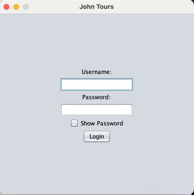
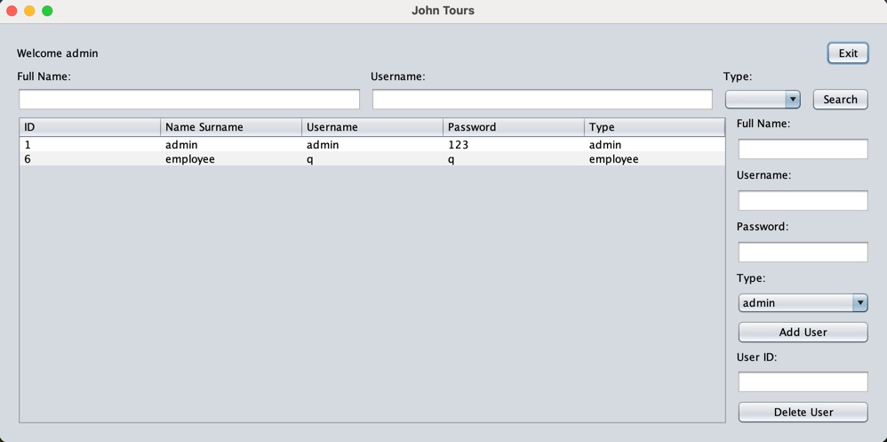

# TourismAgencySystem

## Project Description:
- This is a project for our Patika+ Bootcamp, in which we have to develop a system for a tourism agency.
- The system must be able to manage the agency's customers, employees, and reservations.

## Project Structure:
- There are two main user types, admin and agency employee.
- The admin is responsible for managing the agency's employees; she/he can create new admin and employee profiles.

## Login Panel:
- The user can login to the system with her/his username and password.

## Admin Panel:
- The admin can create new admin and employee profiles.

## Employee Panel:

