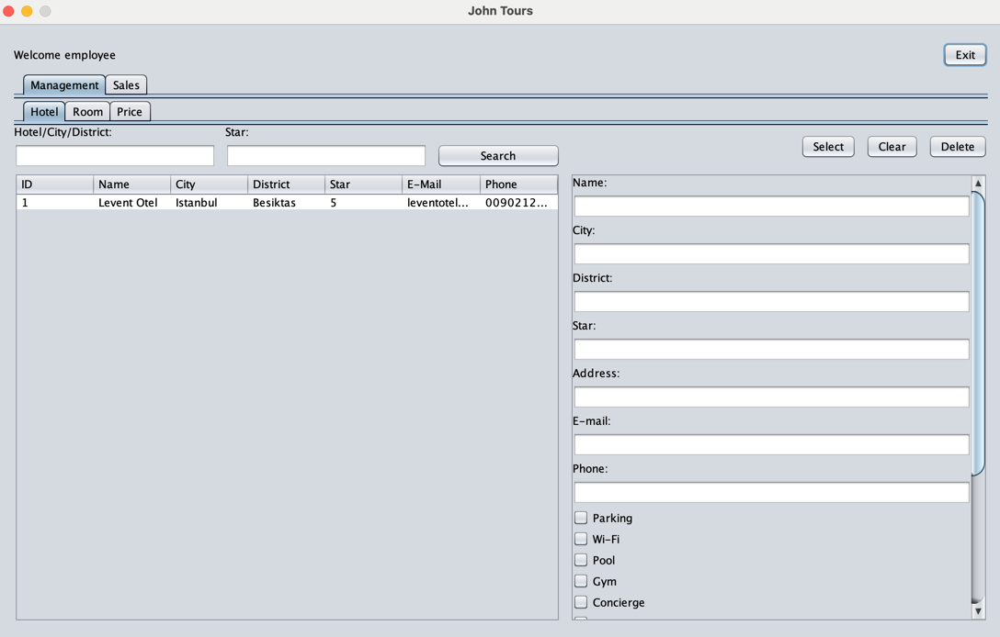
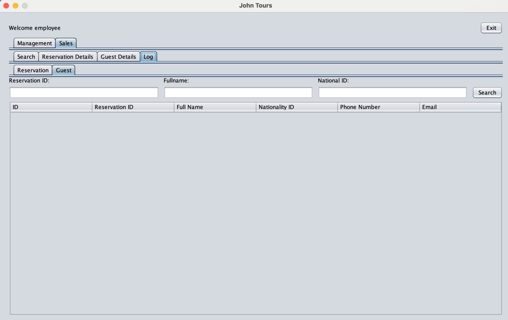

# TourismAgencySystem

## Project Description:
- This is a project for our Patika+ Bootcamp, in which we have to develop a system for a tourism agency.
- The system must be able to manage the agency's customers, employees, and reservations.

## Project Structure:
- There are two main user types, admin and agency employee.
- The admin is responsible for managing the agency's employees; she/he can create new admin and employee profiles.

## Login Panel:
- The user can login to the system with her/his username and password.

## Admin Panel:
- The admin can create new admin and employee profiles.

## Employee Panel:

### Management:
 
- Here, the employee can create:
  - hotels,
  
  
  - rooms for each hotel,
  
  
  - and prices for each room with a different accommodation type.
  
  

### Sales:
 
- Here, the employee can create a new reservation for a customer by:
  - searching for an available room using the search panel,
  
  
  - selecting the accommodation type and calculating the price,
  
  
  - and providing the customer's information.
  
  
  
  - #### Log:
    - Here, the employee can see:
      - all the reservations created,
    
        
      - and all current and previous guests.

        