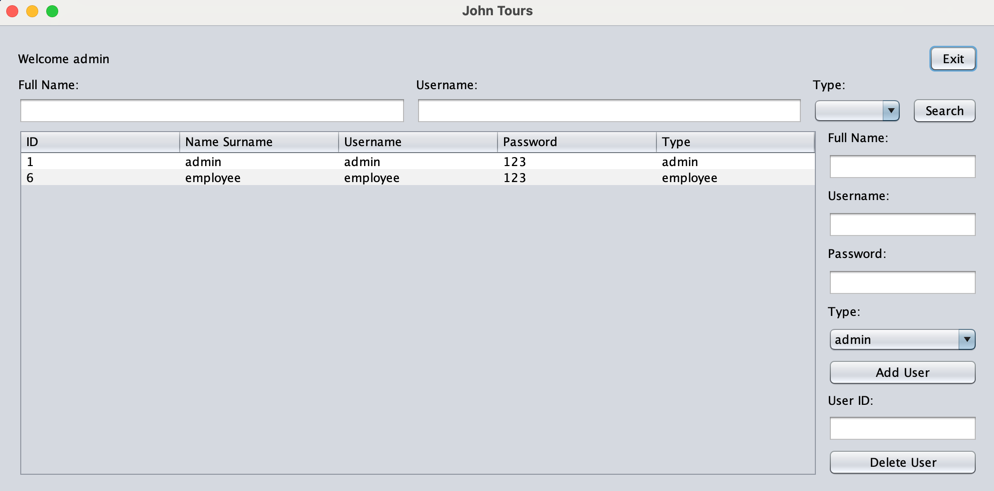

# TourismAgencySystem

## Project Description:
- This is a project for our Patika+ Bootcamp, in which we have to develop a system for a tourism agency.
- The system must be able to manage the agency's customers, employees, and reservations.
- Short video description in Turkish can be found at: https://youtu.be/5X6Z3Z3Z3Z4

## Project Structure:
- There are two main user types, admin and agency employee.
- The admin is responsible for managing the agency's employees; she/he can create new admin and employee profiles.

## Login Panel:
- The user can login to the system with her/his username and password.

  

## Admin Panel:
- The admin can create new admin and employee profiles.

  

## Employee Panel:

### Management:
 
- Here, the employee can create:
  - hotels,
  
    
  - rooms for each hotel,
  
    
  - and prices for each room with different accommodation types.
  
    

### Sales:
 
- Here, the employee can create a new reservation for a customer by:
  - searching for an available room using the search panel,
  
    
  - selecting the accommodation type and calculating the price,
  
    
  - and providing the customer's information.
  
    
  
  - #### Log:
  - Here, the employee can see:
    - all the reservations created,
 
       
    - and all current and previous guests.
                                                      
      